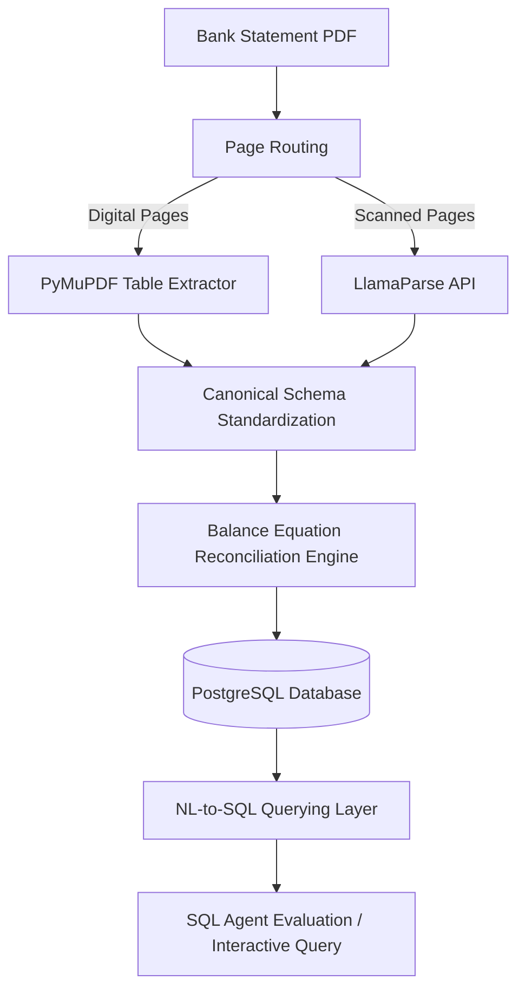

# Auditing Bank Statement PDFs: A Multi-Tier Parser and Design Choices for the NL-to-SQL Query Layer Above It

This repository contains the official implementation, evaluation datasets, and pipeline scripts associated with the paper accepted at **FinNLP 2026** (co-located with **EMNLP 2026**):
> **"Auditing Bank Statement PDFs: A Multi-Tier Parser and Design Choices for the NL-to-SQL Query Layer Above It"**

---

## Overview

Bank statements serve as the primary evidentiary record in financial auditing, yet they typically reach auditors as highly heterogeneous PDFs (some digitally typeset, others scanned) that require tedious manual transcription. This repository presents an end-to-end framework built and evaluated to automate this workflow. It consists of two primary components:

1. **Relational Data Conversion Pipeline**: A multi-tier extraction pipeline that ingests statement PDFs, determines whether page layouts are digital or scanned, extracts tables using a deterministic table extractor (**PyMuPDF**) or an OCR/layout parser (**LlamaParse**), standardizes heterogeneous headers to a canonical schema, and uses a balance equation reconciliation engine to locate and repair extraction errors.
2. **Natural-Language-to-SQL Querying Layer**: A controlled evaluation testbed that studies how the placement of contextual information affects the accuracy of SQL agents. It evaluates five distinct context-injection strategies across multiple LLM generations (e.g., `gemini-2.5-flash` and `gemini-3.5-flash`) on complex auditing queries.

### Ingestion & Evaluation Workflow



---

## Repository Structure & Outputs

### Codebase Structure
*   `data/`: Contains sample statements (`bank-statements/`) and evaluation dataset queries (`QA/dataset.json`).
*   `parser/`: Logic for PDF routing, PyMuPDF table extraction, and LlamaParse integration.
*   `sql_agent/`: SQL agent implementation including client wrappers, query generation, and self-correcting validation.
*   `rag_helper/`: Retrievers and chunking tools for structured and unstructured context-augmented strategies.
*   `utils/`: Database helpers, schema definitions, and validation utilities.
*   `parse_statements.py`: Ingestion script to parse PDFs and populate the database.
*   `bootstrap_*.py`: Setup scripts to generate RAG indexes and ground truths.
*   `run_eval.py`: Evaluation harness for testing context-injection strategies.
*   `run_query.py`: Interactive CLI to test individual natural language queries.

### Generated Outputs (`output/`)
*   `output/parsing/`: Contains intermediate transaction tables parsed from PDF statement pages (under `custom_parser/`) and the generated corpus CSV chunks for Structured/Unstructured RAG.
*   `output/qa/evaluation/ground_truth/`: Executed ground truth SQL results (Excel files) generated by `bootstrap_gt.py`.
*   `output/qa/evaluation/<solution_name>/`: Evaluation run prediction logs (reasoning, generated SQL, output data) per question, along with the consolidated `evaluation_results.xlsx` sheet.
*   `output/qa/run/<solution_name>/run_<timestamp>/`: Outputs from manual interactive query testing runs using `run_query.py`.

---

## Data Statement & Privacy / PII Handling

To prevent disclosure of proprietary client information while ensuring artifact reproducibility, the two sample statements in `data/bank-statements/` (`PUBALI BANK Mutated.pdf` for Tier 1 and `UTTARA BANK Mutated.pdf` for Tier 2) were sanitized under an exact mutation protocol:
1. **Customer Identity Replacement**: Account holder names, business entities, and authorized signatory/operator names were replaced with synthetic dummy identities (e.g., *John Doe & Sons*, *Alexander Smith*). Account numbers, customer addresses, and telephone/mobile numbers were substituted with fictitious, valid-length dummy data. Public bank names and branch locations were retained.
2. **Transaction Narration Masking**: Counterparty account numbers, physical cheque serials, and inter-bank electronic transfer tracking IDs (`IBFTIN-Tr#`) appearing within transaction narrations were masked with fixed repeating dummy digits (e.g., `99999999999`, `888888`).
3. **Format & Arithmetic Fidelity**: Original transaction dates, debit/credit amounts, running balances, vector line geometries (Tier 1), and scanned OCR noise characteristics (Tier 2) were strictly preserved to ensure the files remain faithful benchmarks for PDF extraction and NL-to-SQL querying.

---

## Prerequisites & Setup

### 1. System Requirements
- Python 3.10+
- Docker & Docker Compose (for running the PostgreSQL database)
- An active API key for **Google Gemini** (and optionally **Llama Cloud** if parsing scanned PDFs)

### 2. Environment Setup
Clone the repository and set up a virtual environment:

```bash
# Create virtual environment
python -m venv venv

# Activate virtual environment
# On Windows (PowerShell):
venv\Scripts\Activate.ps1
# On Windows (CMD):
venv\Scripts\activate.bat
# On Unix/macOS:
source venv/bin/activate

# Install dependencies
pip install -r requirements.txt
```

### 3. Spin up the Database
Start the PostgreSQL database container (mapped to host port `5433` by default as specified in `docker-compose.yml`):
```bash
docker-compose up -d
```

### 4. Configure Environment Variables
Copy `.env.example` to `.env` and populate your API keys:
```bash
cp .env.example .env
```

Open `.env` and set:
- `GEMINI_API_KEYS`: A JSON array of your Gemini API keys (e.g. `["sk-yourkey1", "sk-yourkey2"]` or comma-separated list `key1,key2`).
- `LLAMA_CLOUD_API_KEYS`: A JSON array of your Llama Cloud API keys (required if using scanned PDF parsing via LlamaParse).
- `GEMINI_MODEL` (Optional): Specify the model to evaluate (defaults to `gemini-2.5-flash` in code if not set; can be configured to `gemini-3.5-flash`).

---

## Running the Pipeline

Follow these steps sequentially to ingest the sample statements, build the retrieval indices, and run evaluations:

### Step 1: Parse and Ingest Statement PDFs
Run the parsing script to extract transactions from the PDF statements in `data/bank-statements/` and ingest them into the PostgreSQL database:
```bash
python parse_statements.py
```

### Step 2: Bootstrap Reference Data and Indices
Execute the three bootstrapping scripts to establish the evaluation environment:
```bash
# 1. Generate ground truth SQL results from dataset.json
python bootstrap_gt.py

# 2. Generate structured RAG chunk indexes (CSV-based database chunking)
python bootstrap_structured_rag.py

# 3. Generate unstructured RAG chunk indexes (raw page text chunking)
python bootstrap_unstructured_rag.py
```

### Step 3: Run Evaluation
To evaluate SQL agent performance, run the evaluation script. By default, running without arguments will evaluate all five context-injection strategies sequentially:
```bash
# Run evaluation across all 5 strategies
python run_eval.py
```

Alternatively, you can evaluate a specific strategy using the `--solution` flag:
```bash
# Run evaluation for a specific strategy
python run_eval.py --solution zero_context_sql
```

**Available Solutions:**
*   `zero_context_sql`: Baseline zero-context prompt.
*   `unstructured_rag_sql`: Prompts augmented with retrieved raw text pages.
*   `structured_rag_sql`: Prompts augmented with retrieved structured table rows in CSV format.
*   `self_correcting_sql`: Zero-context with a self-correction loop checking query syntax and execution output.
*   `self_correcting_structured_rag_sql`: Combined strategy utilizing structured context and a self-correction loop.

Evaluation results are consolidated in `output/qa/evaluation/evaluation_results.xlsx`.

---

## Testing Individual Queries

To execute an individual query interactively and view the agent's reasoning, generated SQL, and database output:

```bash
# Run query with default (zero_context_sql) solution
python run_query.py --question "Top five transactions by amount."
```

To run the query using a specific strategy, use the `--solution` flag:
```bash
python run_query.py --solution structured_rag_sql --question "Top five transactions by amount."
```

---

## Data & Privacy Note

In accordance with confidentiality constraints regarding financial records from our industry partner, proprietary bank statements used in the main evaluation cannot be made public. This repository provides two privacy-preserving, mutated sample statements (`data/bank-statements/`) and a sample query dataset (`data/QA/dataset.json`) allowing full end-to-end execution and verification of the pipeline.

