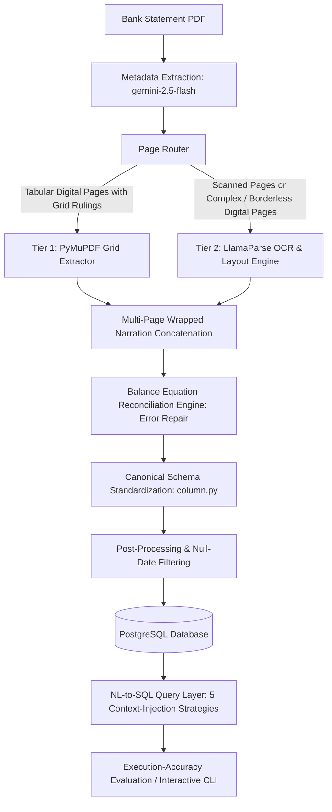

# Auditing Bank Statement PDFs: A Multi-Tier Parser and Design Choices for the NL-to-SQL Query Layer Above It

Official repository for the paper accepted at **FinNLP 2026** (co-located with **EMNLP 2026**):
> **"Auditing Bank Statement PDFs: A Multi-Tier Parser and Design Choices for the NL-to-SQL Query Layer Above It"**

---

## Overview

Bank statements are the primary evidentiary record in financial auditing, yet they reach auditors as heterogeneous PDFs (some digitally typeset, others scanned) that require slow, error-prone manual transcription into spreadsheets. This repository implements an end-to-end system that automates this workflow in two stages:

1. **Multi-Tier Parser (Stage 1)**: Converts statement PDFs into a validated relational database. It extracts document-level metadata via a vision-capable LLM, routes pages between a deterministic grid extractor (**PyMuPDF**) and an OCR/layout parser (**LlamaParse**), repairs extraction errors with a running-balance reconciliation engine, standardizes idiosyncratic headers into a canonical schema, and ingests transactions into PostgreSQL.
2. **NL-to-SQL Query Layer (Stage 2)**: Evaluates five context-injection strategies across multiple LLM generations (`gemini-2.5-flash` and `gemini-3.5-flash-preview`) to execute complex financial audit queries against the database with execution-accuracy scoring.

---

## Pipeline Architecture



### Key Ingestion Mechanics
- **Page Routing**: Tier 1 (PyMuPDF) is applied exclusively to digital pages with clean ruling-line grids matching the expected column count. Pages without clear ruling lines, borderless tabular layouts, or scanned images fall back to Tier 2 (LlamaParse).
- **Multi-Page Narration Stitching**: Continuation rows that wrap across page boundaries (rows with descriptive text but no numeric debit/credit/balance entries) are merged back into the preceding transaction.
- **Balance Reconciliation Before Standardization**: Error recovery checks the running-balance identity ($\text{Balance}_t = \text{Balance}_{t-1} + \text{Deposit}_t - \text{Withdrawal}_t$) directly on the raw extracted columns. It detects and repairs OCR artifacts (sign inversions, decimal shifts, credit/debit column swaps) before mapping to canonical column names.
- **Canonical Schema Standardization**: Maps bank-specific header variants (e.g., *Particulars*, *Narration*, *Dr Amount*, *Withdrawal*) into unified relational attributes using a regex matching library (`parser/column.py`).

---

## Released Artifacts vs. Research Benchmark

| Component | Released in This Repository | Full Research Benchmark (Paper) |
| :--- | :--- | :--- |
| **Bank Statements** | **2 mutated sample statements** (`data/bank-statements/`) | 23 statements across 20 commercial banks (75 pages, 1,672 transactions) |
| **Parsing Tiers** | `PUBALI BANK Mutated.pdf` (Tier 1), `UTTARA BANK Mutated.pdf` (Tier 2) | 11 statements (8 banks) in Tier 1; 12 statements (12 banks) in Tier 2 |
| **Auditing Queries** | **10 sample queries** with gold SQL (`data/QA/dataset.json`) | 150 natural-language auditing questions with hand-authored gold SQL |
| **Pipeline Code** | **Full implementation** (Parser, Reconciliation, RAG, SQL Agent, Eval) | Same |

> **Confidentiality Note**: Full bank statements and the 150-query evaluation workload belong to an industry auditing partner and cannot be published. The two privacy-preserving mutated statements and 10 sample queries provide a fully functional, runnable testbed for the entire pipeline.

---

## Data Statement & Privacy / PII Handling

The two released sample statements were sanitized under an exact mutation protocol to protect client privacy while guaranteeing benchmark fidelity:

1. **Customer Identity Replacement**: Account holder names, business entities, and signatory names were substituted with synthetic dummy identities (e.g., *John Doe & Sons*, *Alexander Smith*). Account numbers, customer street addresses, and telephone numbers were replaced with fictitious, valid-length data. Public bank and branch names were retained.
2. **Transaction Narration Masking**: Counterparty account numbers, physical cheque serials, and inter-bank electronic tracking strings (`IBFTIN-Tr#`) within transaction narrations were masked with fixed repeating dummy digits (e.g., `99999999999`, `888888`).
3. **Arithmetic & Layout Fidelity**: Original transaction dates, debit/credit amounts, running balances, vector line geometries (Tier 1), and scanned OCR noise characteristics (Tier 2) were strictly preserved so that table extraction, balance reconciliation, and SQL execution remain mathematically and empirically representative.

---

## Repository Structure

```
├── data/
│   ├── bank-statements/        # Released mutated PDF statements (Pubali Bank, Uttara Bank)
│   └── QA/
│       └── dataset.json        # Sample auditing query workload with gold SQL
├── parser/
│   ├── main.py                 # Multi-tier ingestion & balance reconciliation pipeline
│   ├── column.py               # Canonical schema regex matcher & column definitions
│   ├── prompts.py              # Vision & metadata prompts for Gemini and LlamaParse
│   └── utils.py                # Table parsing & layout helpers
├── rag_helper/
│   ├── df_chunker.py           # Structured CSV-based chunking
│   ├── text_chunker.py         # Unstructured text chunking
│   ├── retriever.py            # SentenceTransformer & FAISS retriever wrappers
│   └── pdf_parser.py           # pdfplumber baseline parser
├── sql_agent/
│   ├── agent.py                # SQLAgent orchestrator
│   ├── query_generator.py      # LLM prompt construction & query generation
│   ├── query_validator.py      # Self-correction loop & execution feedback
│   └── llm_client.py           # Gemini API client wrapper with key rotation
├── parse_statements.py         # Ingests PDF statements into PostgreSQL
├── bootstrap_gt.py             # Executes gold SQL to generate ground truth result sets
├── bootstrap_structured_rag.py   # Builds structured CSV chunk corpus and FAISS cache
├── bootstrap_unstructured_rag.py # Builds unstructured raw-text chunk corpus
├── run_eval.py                 # Evaluates context-injection strategies on the QA workload
├── run_query.py                # CLI tool to test individual natural-language queries
├── docker-compose.yml          # PostgreSQL database container configuration
├── init_db.sql                 # Database table schema and trigram GIN indices
└── requirements.txt            # Python dependencies
```

---

## Setup & Quickstart

### 1. Prerequisites
- Python 3.10+
- Docker & Docker Compose
- API Keys:
  - **Google Gemini API Key** (required for metadata extraction and SQL agent execution)
  - **Llama Cloud API Key** (required for Tier 2 scanned statement parsing)

### 2. Environment Setup
```bash
# Clone the repository
git clone https://github.com/ahemtiaz/auditing-bank-statement-pdfs.git
cd auditing-bank-statement-pdfs

# Create and activate a virtual environment
python -m venv venv
# Windows (PowerShell):
venv\Scripts\Activate.ps1
# Linux/macOS:
source venv/bin/activate

# Install dependencies
pip install -r requirements.txt
```

### 3. Start the Database
Start the PostgreSQL container (mapped to port `5433` by default):
```bash
docker-compose up -d
```

### 4. Configure Environment Variables
Copy `.env.example` to `.env` and provide your API keys:
```bash
cp .env.example .env
```
Edit `.env`:
```env
GEMINI_API_KEYS=["your-gemini-api-key"]
LLAMA_CLOUD_API_KEYS=["your-llama-cloud-key"]
GEMINI_MODEL=gemini-2.5-flash
```

---

## Running the Pipeline

### Step 1: Parse and Ingest Statement PDFs
Extracts transactions from `data/bank-statements/*.pdf`, executes reconciliation error repairs, maps columns to the canonical schema, and populates PostgreSQL:
```bash
python parse_statements.py
```
*Outputs: Parsed Excel workbooks and logs in `output/parsing/custom_parser/`.*

### Step 2: Bootstrap Reference Data & RAG Indices
```bash
# 1. Execute gold SQL to create ground truth comparison targets
python bootstrap_gt.py

# 2. Generate structured CSV chunks from the parsed database tables
python bootstrap_structured_rag.py

# 3. Generate unstructured raw-text chunks from pdfplumber extractions
python bootstrap_unstructured_rag.py
```

### Step 3: Run Evaluation Harness
Run the evaluation harness over all 5 context-injection strategies sequentially:
```bash
python run_eval.py
```
Or evaluate a single strategy:
```bash
python run_eval.py --solution zero_context_sql
```
*Results are written to `output/qa/evaluation/evaluation_results.xlsx`.*

### Context-Injection Strategies

| Strategy Key | Validator Feedback Loop | Context Injected into Prompt | Retrieval Source |
| :--- | :---: | :--- | :--- |
| `zero_context_sql` | No | Schema only | — |
| `unstructured_rag_sql` | No | Top-$k$ raw text chunks | `pdfplumber` page text |
| `structured_rag_sql` | No | Top-$k$ CSV table rows | Parser-generated CSV |
| `self_correcting_sql` | Yes | Error feedback loop | — |
| `self_correcting_structured_rag_sql` | Yes | Top-$k$ CSV table rows + feedback | Parser-generated CSV |

---

## Interactive Query CLI

Test ad-hoc natural-language questions against the ingested database and inspect the generated SQL and execution outputs:

```bash
python run_query.py --question "Show the top five transactions by debit amount."
```

To test with a specific strategy:
```bash
python run_query.py --solution structured_rag_sql --question "What was the closing balance on the final statement page?"
```

---

## Citation

```
BibTeX citation will be added upon arXiv release / official proceedings publication.
```

---

## License

This project is licensed under the MIT License. See the [LICENSE](LICENSE) file for details.
